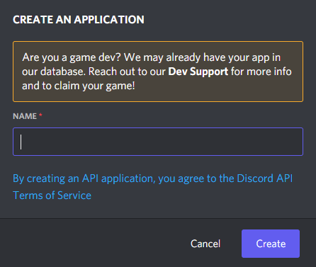
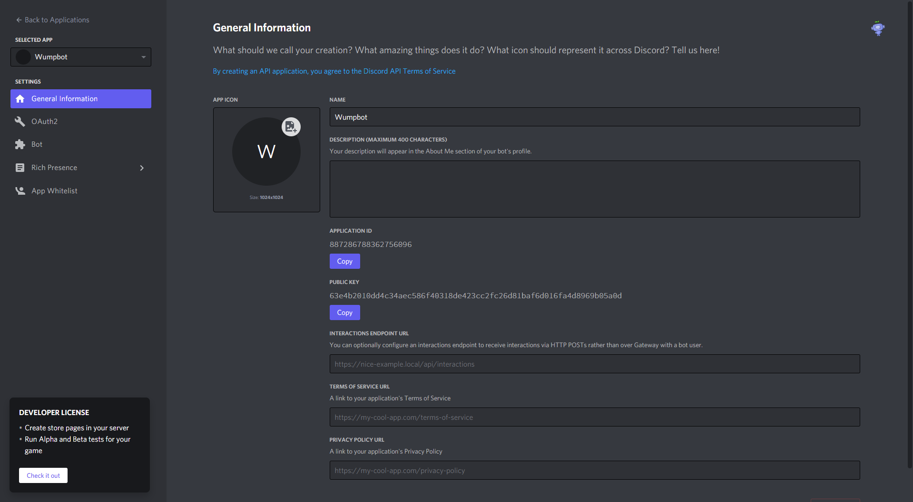
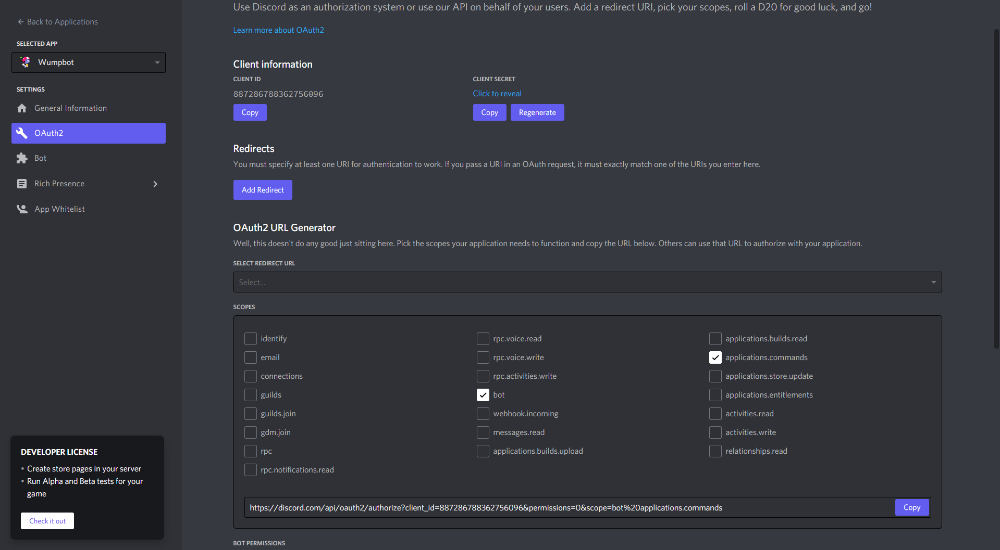

# Creating the bot

The first step of all Discord tutorials is to create the bot account, this is how you
authenticate and talk to the Discord API.

## Creating an application

Discord's API consist of applications. These applications are used for games, "Log in with
Discord", and of course - bots!

Start by navigating to the [Discord Developer Portal](https://discord.com/developers/). The
page should look like this:

Now click the "New Application" button at the top right. This will prompt you for a name for
your application, like this:

Wumpus decided to call its bot "Wumpbot", but you are free to name yours as you wish.

Now click "Create", you should see the following page:

This step is completely optional, but you can now add a description and picture to your
application if you want to.

## Adding a bot to the mix

It is now time to add a bot to the application, click the "Bot" tab in the sidebar. It should
look like this:

Click "Add Bot" in the top right and then "Yes, do it!" in the following dialog box to confirm.

There is now a bot attached to your application and you should see the following page:

## Inviting the bot to your server

The very last part of creating a Discord bot is inviting it to your server.

In the left sidebar go to "OAuth2" and pick "bot" as well as "application.commands" in the
OAuth2 URL Generator at the bottom of the page.

Now copy the link generated and open it in your browser, it should look like this:

Select the server you want to add the bot to and click "Authorize". The bot will then appear
in your server with the power of technology.

